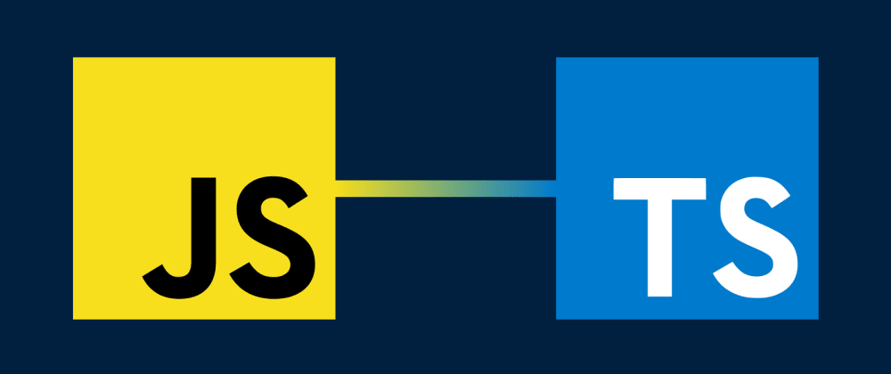

<h1 align="center">
 Desafio 04:  Migração de JS  ☞  TS
</h1>

  

  

  

  

# 💻 Sobre o desafio

Essa será uma aplicação já funcional onde o seu principal objetivo é realizar dois processos de migração: de Javascript para Typescript e de Class Components para Function Components.

    <a href="https://github.com/luanyata/IgniteFood/tree/d514e22344adc112dfc6dfb119c51add5c4db2c5">
        Projeto Javascript
    </a>
    ~~~|~~~
    <a href="https://github.com/luanyata/IgniteFood">
        Projeto Typescript
    </a>

